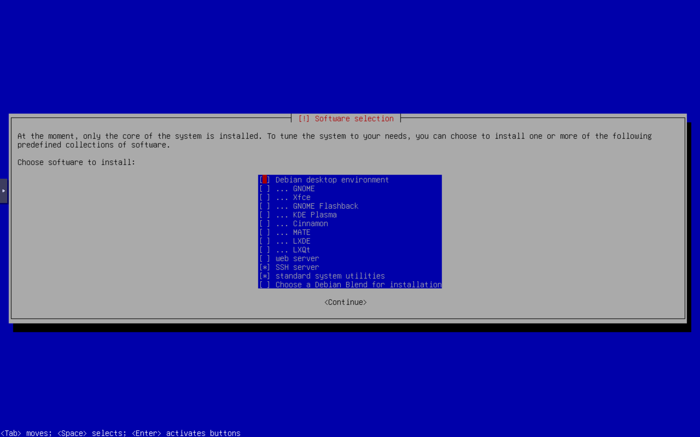

# 网络配置与管理

在Ubuntu Server的安装中，在安装界面就已经提示要求配置本机的IP地址，当时是直接选择的静态IP，这样我们在开机的时候非常顺利的使用SSH连接上，但是网络配置上Ubuntu的网络框架较为新，所以传统框架需要使用Debian，下载安装最新版本的Debian 13安装镜像即可

## Debian 13安装

我们需要重新安装一个全新的Debian 13虚拟机，网络安装镜像或者本地DVD镜像都可以

Debian安装时的配置比Ubuntu Server少很多，只有一个方面需要注意，也就是软件选择上，按照下图进行选择即可



## 传统网络框架 —— `ifupdown`

这个框架的配置文件格式非常清晰，但是因为Ubuntu Server上使用Network Manager管理框架，所以我们安装默认使用这个框架的Debian 13，Debian 13默认创建root账户，我们这里直接使用root账号登录

### 配置文件位置

`ifupdown`框架的配置文件位置在`/etc/network/interfaces`中，Debian 13默认安装`nano`文本编辑器，所以我们先使用文本编辑器打开这个配置文件

```bash
nano /etc/network/interfaces
```

---
### 配置文件查看与理解

配置文件内容如下：

```ini
# This file describes the network interfaces available on your system
# and how to activate them. For more information, see interfaces(5).

source /etc/network/interfaces.d/*

# The loopback network interface
auto lo
iface lo inet loopback

# The primary network interface
allow-hotplug ens18
iface ens18 inet dhcp
```

里面一共写了两张网卡的配置，`lo`是本地回环网卡，也就是常见的`127.0.0.1`，为了确保剩下一张是我们联网的网卡，可以输入这个命令查看

```bash
ip addr
```

系统返回如下

```bash
1: lo: <LOOPBACK,UP,LOWER_UP> mtu 65536 qdisc noqueue state UNKNOWN group default qlen 1000
    link/loopback 00:00:00:00:00:00 brd 00:00:00:00:00:00
    inet 127.0.0.1/8 scope host lo
       valid_lft forever preferred_lft forever
    inet6 ::1/128 scope host noprefixroute
       valid_lft forever preferred_lft forever
2: ens18: <BROADCAST,MULTICAST,UP,LOWER_UP> mtu 1500 qdisc fq_codel state UP group default qlen 1000
    link/ether bc:24:11:c1:b9:7b brd ff:ff:ff:ff:ff:ff
    altname enp0s18
    altname enxbc2411c1b97b
    inet 192.168.1.108/24 brd 192.168.1.255 scope global dynamic noprefixroute ens18
       valid_lft 85642sec preferred_lft 74842sec
    inet6 fd3e:7e16:83e6::225/128 scope global dynamic noprefixroute
       valid_lft 42439sec preferred_lft 42439sec
    inet6 fd3e:7e16:83e6:0:2989:c87d:c10f:ae89/64 scope global dynamic mngtmpaddr noprefixroute
       valid_lft 4813sec preferred_lft 2113sec
    inet6 fe80::79f5:5e4:4363:5ebc/64 scope link
       valid_lft forever preferred_lft forever
```

说明现在我们总共两张网卡，一个本地回环的`lo`，另一个则是正常负责上网的`ens18`网卡，所以我们需要设置`ens18`这张网卡的静态IP地址

---

### 配置文件的编辑

我们需要对配置文件做出相对应的修改，首先将原本的动态DHCP换成静态的固定IP地址，以及配置对应的IP地址，网管，DNS等

```ini
# This file describes the network interfaces available on your system
# and how to activate them. For more information, see interfaces(5).

source /etc/network/interfaces.d/*

# The loopback network interface
auto lo
iface lo inet loopback

# The primary network interface
allow-hotplug ens18
iface ens18 inet dhcp # [!code --]
iface ens18 inet static # [!code ++]
	address 192.168.1.10/24 # [!code ++]
	gateway 192.168.1.1 # [!code ++]
	dns-nameserver 223.5.5.5 # [!code ++]
```

但是因为`allow-hotplug`在配置文件中，这个网卡是只有在重新插拔之后配置才能生效，所以为了能够最快时间生效，我们需要将这个改为`auto`

```ini
# This file describes the network interfaces available on your system
# and how to activate them. For more information, see interfaces(5).

source /etc/network/interfaces.d/*

# The loopback network interface
auto lo
iface lo inet loopback

# The primary network interface
allow-hotplug ens18 # [!code --]
auto ens18 # [!code ++]
iface ens18 inet static
	address 192.168.1.10/24
	gateway 192.168.1.1
	dns-nameserver 223.5.5.5
```

---

### 使配置文件生效

重启网络服务，使网络配置重新加载

```bash
sudo systemctl restart networking
```

---
### 检查IP生效情况

```bash
ip addr
```

## 现代网络框架 —— `netplan`

相较于传统的网络配置，`netplan`最明显的就是他的配置文件格式，从以前的`ini`格式换成了更简洁而且容易看懂的`yaml`格式

---

### 配置文件的位置

配置文件通常位于`/etc/netplan/`这个目录下，不同的机器安装之后这个文件名称也不一样，但是通过查看目录下配置文件就可以看到

```bash
ls /etc/netplan/
```

系统会显示一个`yaml`文件

```bash
50-cloud-init.yaml
```

---

### 配置文件查看与理解

在编辑这个文件之前，我们需要看一下这个文件内的具体内容

```bash
sudo cat /etc/netplan/50-cloud-init.yaml
```

返回文件内的具体内容

```yaml
network:
  version: 2
  ethernets:
    ens18:
      addresses:
      - "192.168.1.4/24"
      nameservers:
        addresses:
        - 223.5.5.5
        search: []
      routes:
      - to: "default"
        via: "192.168.1.1"
```

里面能很清晰看到我们一张网卡的信息

> - **ens18**：网卡的名称
> - **addresses**：IP地址，但是需要写成带子网掩码的格式例如子网掩码是`255.255.255.0`要写成`/24`
> - **namservers**：DNS服务器
> - **routes**：路由，也就是网关`gateway`

---

### 编辑配置文件

如果我想将IP地址从`192.168.1.4`换成`192.168.1.10`

```yaml
network:
  version: 2
  ethernets:
    ens18:
      addresses:
      - "192.168.1.4/24" # [!code --]
      - "192.168.1.10/24" # [!code ++]
      nameservers:
        addresses:
        - 223.5.5.5
        search: []
      routes:
      - to: "default"
        via: "192.168.1.1"
```

---

### 使配置文件生效

`netplan`的生效方式不一样，`netplan`本质上是一个一次性命令行工具，不需要系统的守护进程，所以我们需要使`netplan`生效即可

```bash
sudo netplan apply
```

---

### 检查IP生效情况

```bash
ip addr
```