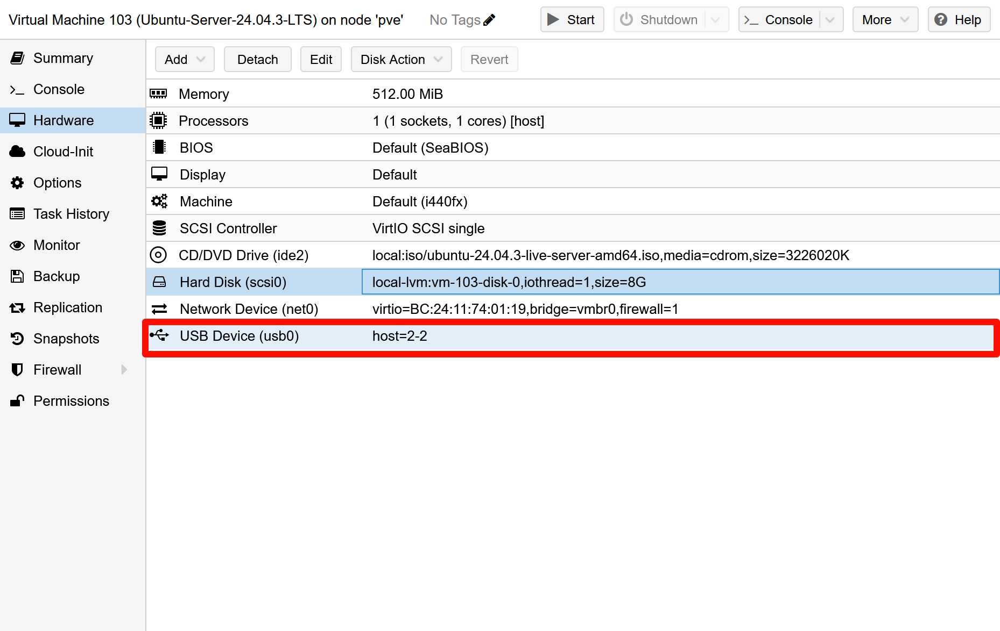
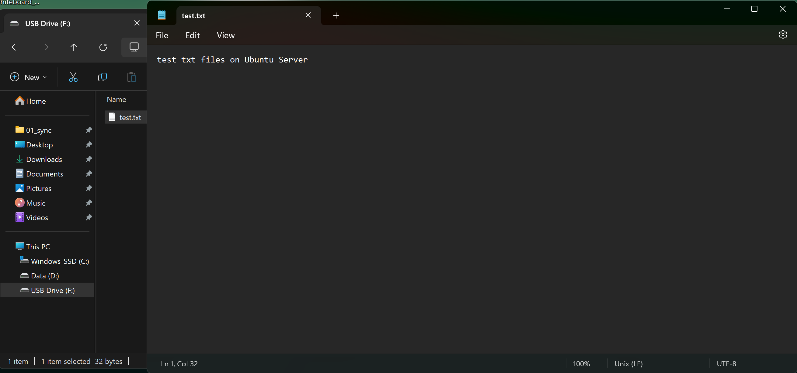

# 磁盘与存储管理

磁盘管理方面，可能在安装Arch Linux系统会更容易接触到，但是雪此成本和曲线太大，所以这一章内容还是使用Ubuntu Server虚拟机进行，对U盘进行操作，确保能有一个数据已经备份过的U盘

## 开启虚拟机USB直通

VMware的虚拟机软件在插入U盘的时候会弹出弹窗提示是否直通给虚拟机，但是像是PVE和ESXi这样的平台需要手动的加上**USB直通**



## 检查磁盘

我们先在需要很快的看出我们插上的U盘是否出现，可以使用一个最简洁直观的方式去查看这个磁盘

```bash
lsblk
```

系统给出了这个回复

```bash
NAME   MAJ:MIN RM  SIZE RO TYPE MOUNTPOINTS
sda      8:0    0    8G  0 disk
├─sda1   8:1    0    1M  0 part
└─sda2   8:2    0    8G  0 part /
sdb      8:16   1 29.3G  0 disk
sr0     11:0    1  3.1G  0 rom
```

我的这个U盘是32G的，现在出现了`sdb`这块磁盘

## 挂载磁盘

挂载这个动作实际目的是将U盘的存储目录挂载到Linux文件树的其中一个文件夹内，需要使用到`mount`命令

一般挂载的目录会挂载在`/mnt/`下面的文件夹下，所以我就挂载在`usb`目录下了

```bash
# 创建目录
sudo mkdir /mnt/usb

# 挂载磁盘
mount /dev/sdb /mnt/usb
```

## 查看文件

直接查看挂载目录

```bash
sudo ls /mnt/usb
```

因为磁盘内没有文件，所以只返回了这个

```bash
lost+found
```

## 磁盘分区

在Windows当中应该很多人都知道C盘D盘，至少也听说过C盘红了可以从D盘挪一部分空间，这是因为都是一块磁盘划分出来的两个分区，C盘和D盘不是两个真是磁盘，而是连个分区

我们先在就对这个U盘划分除这样的两个分区

---
### 取消先前的挂载

```bash
sudo umount /dev/sdb
```

::: details 取消挂载磁盘的方式 {open}
```bash
# 通过挂载点卸载
sudo umount /mnt/usb

# 通过设备文件卸载
sudo umount /dev/sdb
```
:::

---

### 对磁盘重新分区

对磁盘重新分区在命令行中使用`fdisk`工具进行

```bash
sudo fdisk /dev/sdb
```

出现以下结果

```bash
Welcome to fdisk (util-linux 2.39.3).
Changes will remain in memory only, until you decide to write them.
Be careful before using the write command.

The device contains 'ext4' signature and it will be removed by a write command. See fdisk(8) man page and --wipe option for more details.

Device does not contain a recognized partition table.
Created a new DOS (MBR) disklabel with disk identifier 0x24d0d017.

Command (m for help):
```

::: tip
翻译如下：

```text
欢迎使用 fdisk (util-linux 2.39.3)
所有更改仅在内存中保留，直到您决定写入它们。
执行写入命令前请小心。

设备包含 'ext4' 签名，执行写入命令时该签名将被移除。
详细信息请参阅 fdisk(8) 手册页和 --wipe 选项。

设备不包含可识别的分区表。
已创建新的 DOS (MBR) 磁盘标签，磁盘标识符为 0x24d0d017。

命令（输入 m 获取帮助）：
```
:::

输入`n`，新建一块全新的磁盘

出现以下结果

```bash
Partition type
   p   primary (0 primary, 0 extended, 4 free)
   e   extended (container for logical partitions)
Select (default p): 
```

::: warning
这里的意思是让我选择新建分区是主分区还是扩展分区，主分区一块硬盘上只能有四个，但是扩展分区可以有无数个
:::

新建一个主分区即可，输入`p`

出现以下结果

```bash
Partition number (1-4, default 1):
```

::: warning
这个是分区的区号，默认即可
:::

回车选择默认选项即可

出现以下结果

```bash
First sector (2048-61439999, default 2048):
```

::: warning
这个是起始扇区号，选择默认即可
:::

回车选择默认选项即可

出现以下结果

```bash
Last sector, +/-sectors or +/-size{K,M,G,T,P} (2048-61439999, default 61439999): 
```

::: warning
这个是结束扇区号，我们假设这个磁盘需要的大小是4G
:::

新建一个主分区即可，输入`+4G`

出现以下结果

```bash
Created a new partition 1 of type 'Linux' and of size 4 GiB.
```

::: tip
至此成功创建一个全新的磁盘，剩下的一个磁盘也按照这个方法继续划分

**只划分两个磁盘的话，在第二个磁盘划分时可以在结束扇区部分直接按下回车选择默认就是一块全新的磁盘**
:::

**输入`w`，保存分区，自己会退出**

---
### 检查分区是否划分成功

输入磁盘检查指令

```bash
lsblk
```

输出以下内容表示成功了

```bash
NAME   MAJ:MIN RM  SIZE RO TYPE MOUNTPOINTS
sda      8:0    0    8G  0 disk
├─sda1   8:1    0    1M  0 part
└─sda2   8:2    0    8G  0 part /
sdb      8:16   1 29.3G  0 disk
├─sdb1   8:17   1    4G  0 part
└─sdb2   8:18   1 25.3G  0 part
sr0     11:0    1  3.1G  0 rom
```

---
### 格式化新分区

将两个分区都格式化为`FAT32`

```bash
# 将第一个分区格式化为 FAT32
sudo mkfs.vfat -F 32 /dev/sdb1
# 将第二个分区格式化为 ext4
sudo mkfs.vfat -F 32 /dev/sdb2
```

这个时候会提示

```bash
sudo: mkfs.vfat: command not found
```

我们需要安装这个工具

```bash
sudo apt install dosfstools
```

## 挂载分区并写入文件

下面就是要看看Windows机器上能不能读取Linux上面写入的文件

### 挂载分区

```bash
sudo mount /dev/sdb1 /mnt/usb
```

---
### 写入文件

```bash
# 创建txt
sudo touch /mnt/usb/test.txt

# 编辑
sudo vim /mnt/usb/test.txt
```

随便输入点内容保存即可

---

### 取消挂载

```bash
sudo umount /dev/sdb1
```

## Windows上查看

打开资源管理器和U盘文件中的内容Windows可以正常访问

